# us-agriculture

## Background 
Our aim is to help our audience visualize the U.S agricultural production over the year 2017. To achieve this, we developed an interactive map that contain various information about agricultural products across the country. The platform will help the viewer identify the diversity and intensity of the U.S agricultural output.

The website contained an overview description of the US agriculture, then an interactive map paired with a dropdown menu where the viewer can obtain information by clicking or hovering their mouse on the various counties. A comparison of sales of specific crops per county, by State are provided with graphs. Peripheral info are provided to the viewer, such as images of the specific crop, and local agricultural news concerning the specific crop. Weather info also be provided to give the viewer an idea of the local climate and conditions for growth of the specific agricultural product.

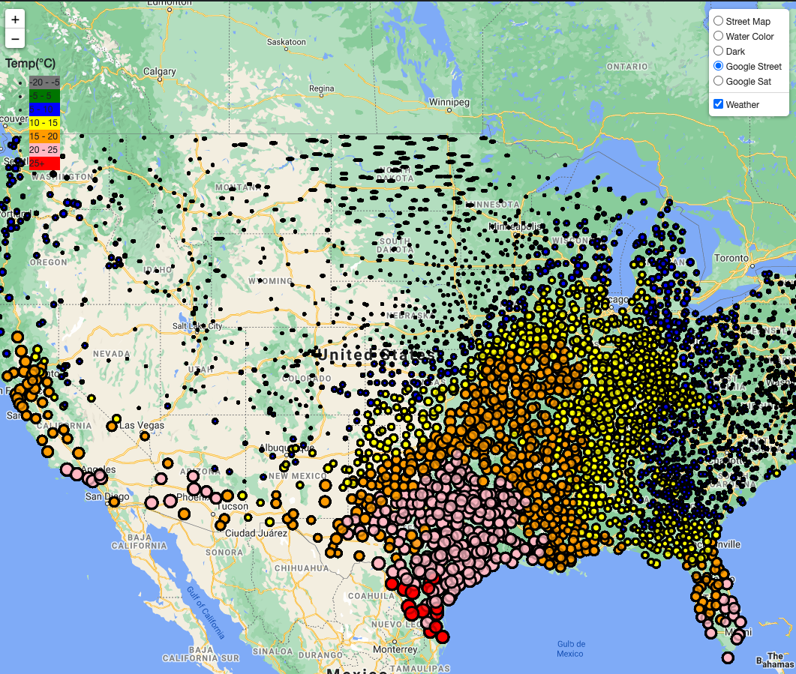

## MongoDB and Flask Application
* We downloaded the data from USDA website which includes all the crops production in US county with sales amount.
* We stroed the data in MongoDB database using pymongo. 
* We have created a intrecative webpage using HTML, CSS, javascript,and Bootstrap.
* We used MongoDB with Flask templating to create a new HTML page that displays all of the information.

* Created a different  routes  that query Mongo database and pass the data into an HTML template to display the data.

* Scraped news and image of particular crops and display the information

* HTML pages contained the visualizations and their corresponding explanations which are as:
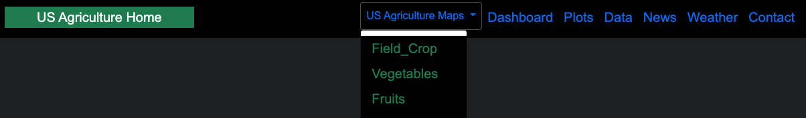 

#### A [landing page](#landing-page) containing:
  * An explanation of the project with  information of using interactive web
  * Can select croptype to get the information of that crop
  * Scraped news and image of particular crops and display the information 
  * Display in map in which county the croptype can be found with sales information
  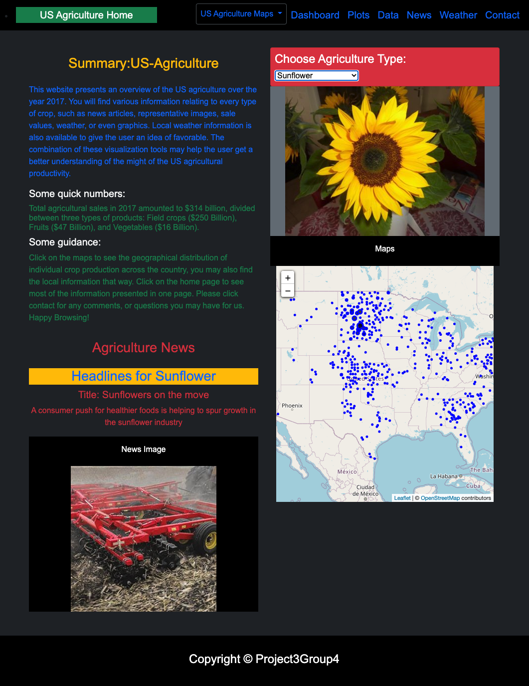

#### A US agriculture maps page, that contain:
 * I Field crops type
  A descriptive information of field crops in the form of map for each county in US.
  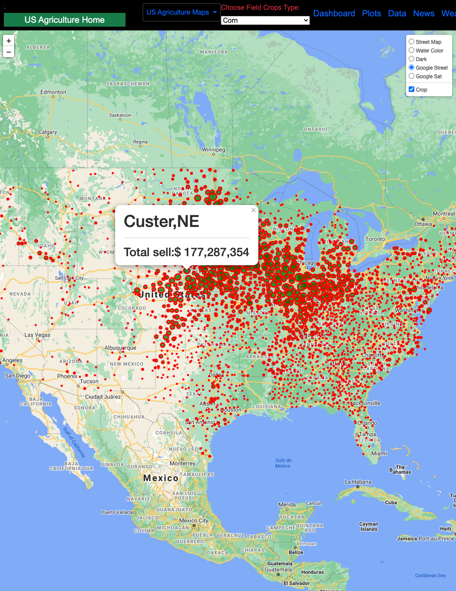

  * II Fruits type
  A descriptive information of fruits in the form of map for each county in US.
  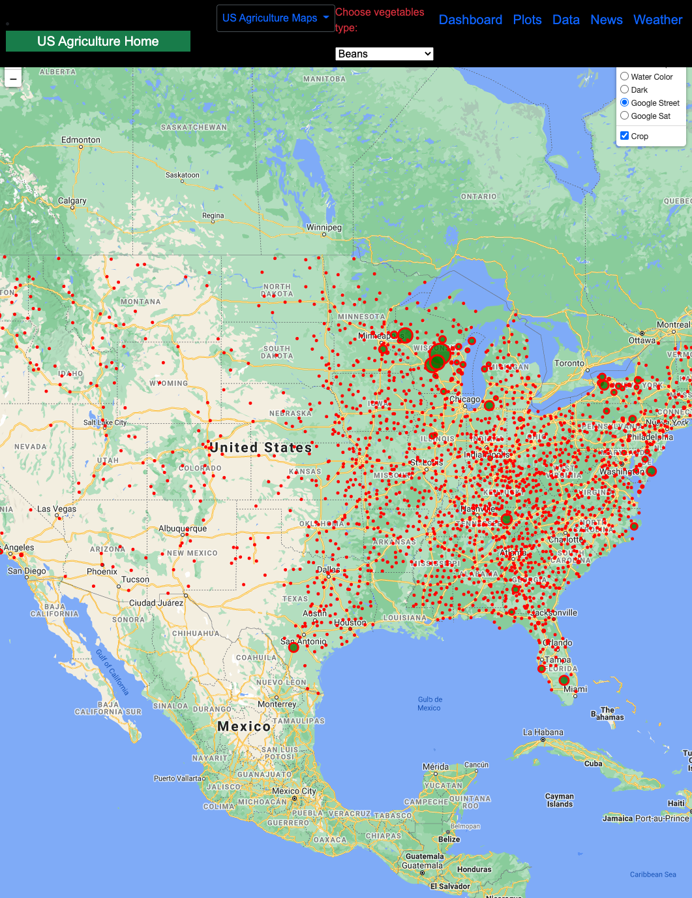

  * III Vegetables type
  A descriptive information of vegetables in the form of map for each county in US.
  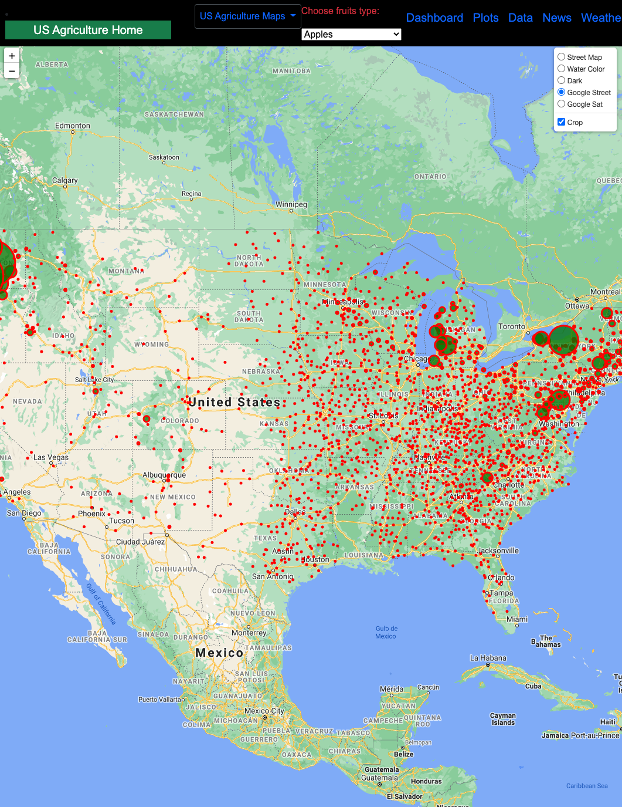

#### A ["Dashboard" page](#dashboard-page):
  Can select State name, Crop type and crop name which show
  * Total sales of the selected crop type.
  * Pie chart for the top 10 counties with the most sale for the selected state
  * Bubbles chart with all the county and sales for the selected state
  * Comprasion of the selected crop for all the other US states 
  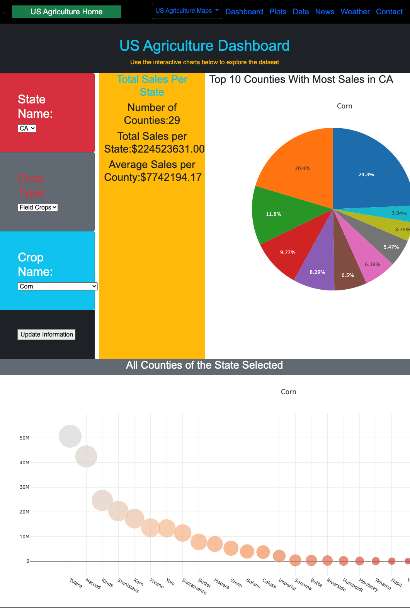
  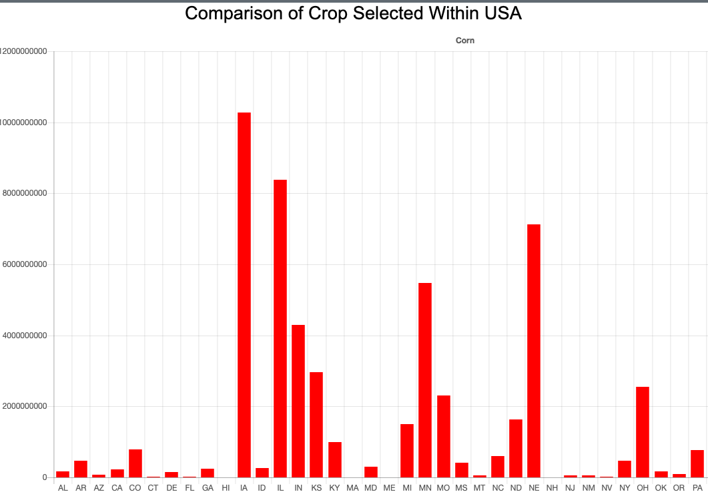

####  A ["Plots" page](#plotd-page) which show:
  * All US crops sales by state in the form of bar chart.
  * Scatter plot of all US counties field crops sales.
  * Scatter plot of all US counties fruits sales.
  * Scatter plot of all US counties vegetables sales.
  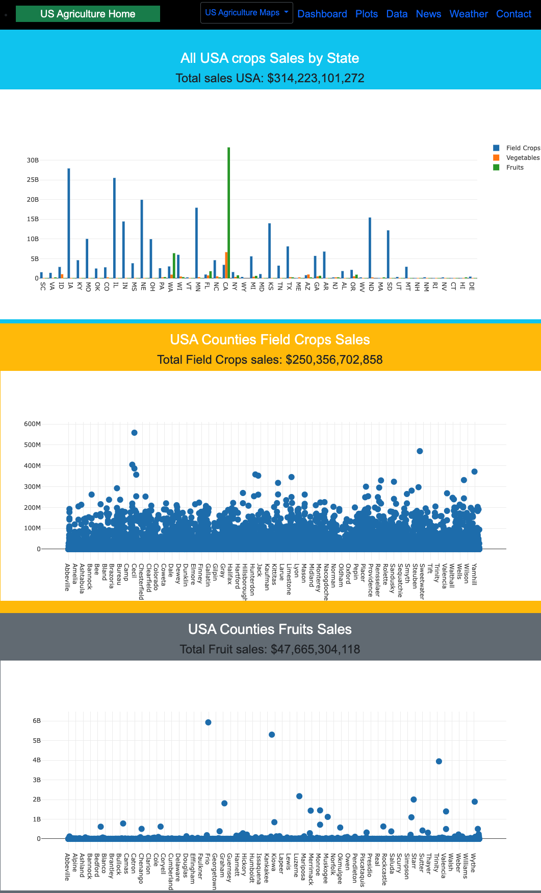

#### A ["News" page](#news-page):
  * Can select the crop types from the dropdown menu
  * Scraped news and image of particular crops and display the information of the selected crop type
  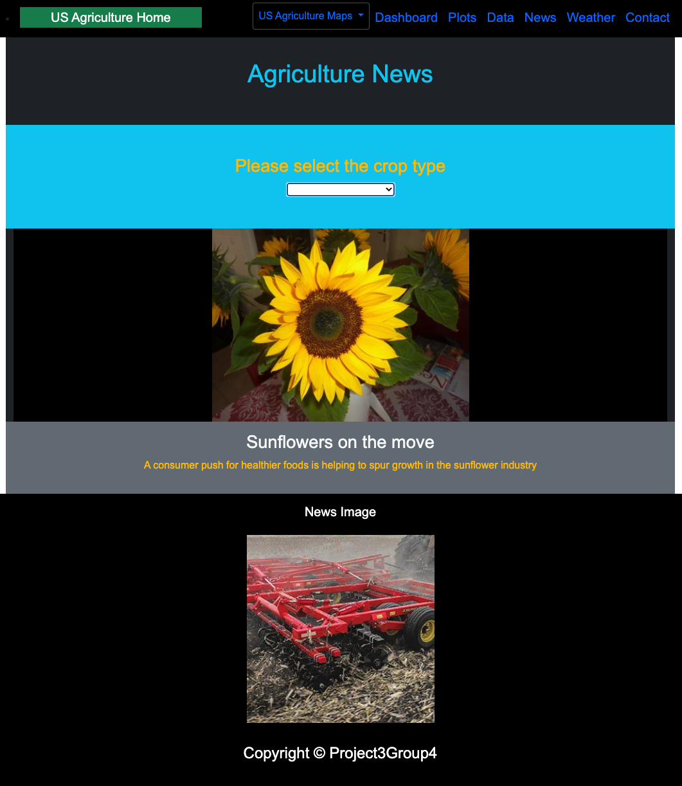

#### A ["Data" page](#data-page):
  Containing all the data information in the form of table.
  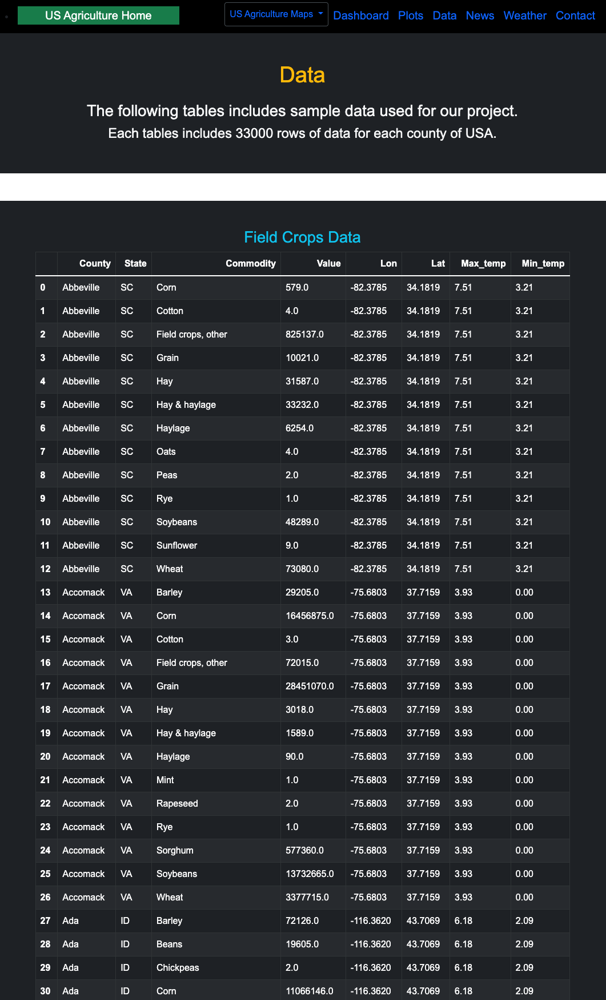

* A ["Weather" page](#weather-page):
  Containing wether information for all US counties.
  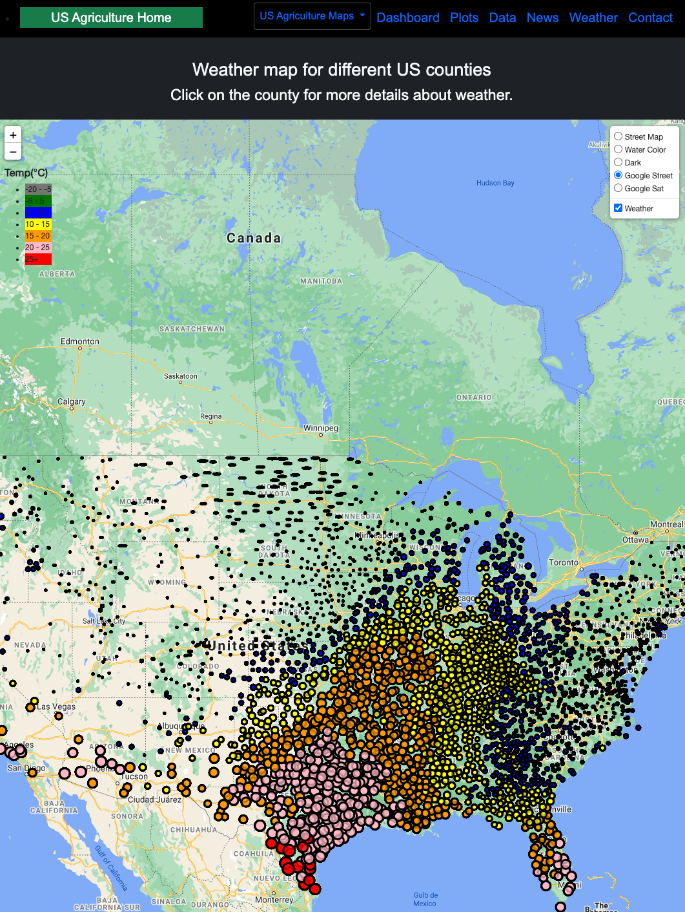

* A ["Contact" page](#contact-page):
  Containing all the contact information.
  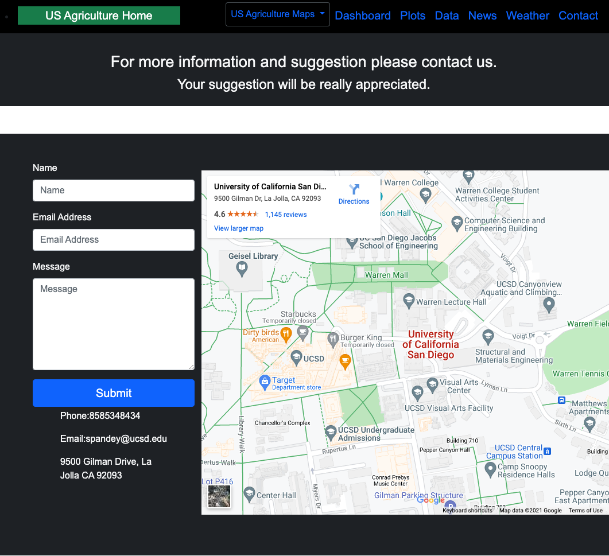

## Data sources 
USDA: https://quickstats.nass.usda.gov/
Agricultural News: https://www.agriculture.com/news/crops
Open Weather: https://openweathermap.org/api
Images: https://world-crops.com
